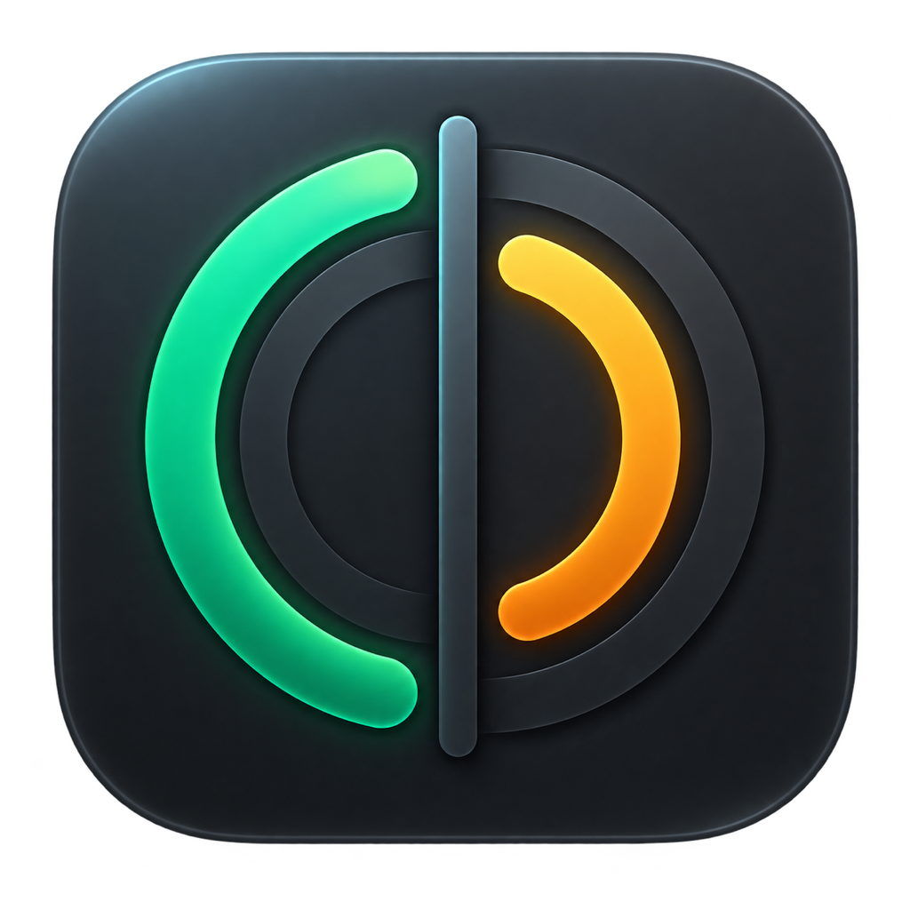

<p align="center">
  
</p>

<h1 align="center">Codex Usage Bar</h1>

<p align="center">Codex kalan kullanımını gösteren özel ve yerel macOS menü çubuğu uygulaması.</p>

<p align="center"><a href="README.md">English</a></p>

## Özellikler

- 5 saatlik ve haftalık kalan kullanım menü çubuğunda `96% | 36%` biçiminde görünür
- İki limiti birlikte, tek tek veya sırası değiştirilmiş biçimde gösterebilir
- Kesin yenilenme tarih ve saatinin yanında canlı geri sayım gösterir
- 15–120 saniye aralığında otomatik yenilenir ve canlı limit bildirimlerini dinler
- %25'lik dilimlerde yeşil, sarı, turuncu ve kırmızı renk kullanır
- ChatGPT planını ve varsa yenileme hakkı sayısını gösterir
- Ayarlar'dan ChatGPT/Codex uygulaması veya `codex` çalıştırılabilir dosyası seçilebilir
- macOS Giriş Öğeleri üzerinden isteğe bağlı olarak oturum açılışında başlatılabilir
- İlk çalıştırmada bağlantı kontrolü, Applications klasörü uyarısı ve otomatik başlangıç seçeneği sunar
- İki limitten biri ilk kez %25'in altına düştüğünde isteğe bağlı bildirim gönderir
- GitHub Releases güncelleme kontrolü ayarlardan kapatılabilir veya elle çalıştırılabilir
- Gizli bilgi içermeyen tanılama raporu ile GitHub, gizlilik ve sorun bildirme bağlantıları sunar
- macOS dil ayarına göre Türkçe veya İngilizce arayüz kullanır

## Gizlilik

Uygulama API anahtarı, OAuth token'ı, e-posta adresi veya hesap kimliği istemez, kaydetmez ve loglamaz. Yalnızca yerel Codex App Server üzerinden limit özeti okunur; kimlik doğrulama mevcut Codex kurulumunuz tarafından yönetilir.

macOS `UserDefaults` içinde yalnızca Codex yolu, yenileme aralığı, karşılama ekranı durumu, menü çubuğu görünümü, otomatik güncelleme kontrolü ve bildirim tercihi saklanır. Otomatik başlangıç ve bildirim izni macOS tarafından yönetilir. Kullanım özeti ve bildirim eşiği karşılaştırması yalnızca bellekte tutulur; uygulama kapanınca silinir.

Otomatik denetim açıkken uygulama açılışta ve yaklaşık altı saatte bir herkese açık GitHub Releases API'sini kontrol eder; yalnızca uygulama sürümünü user-agent içinde gönderir. Codex kimlik bilgileri veya hesap verileri GitHub'a gönderilmez ve güncellemeler otomatik indirilip kurulmaz. Ayrıntılar için [PRIVACY.md](PRIVACY.md) dosyasına bakın.

## Gereksinimler

- macOS 14 veya üstü
- Aktif ChatGPT oturumu bulunan ChatGPT Desktop, Codex Desktop veya Codex CLI
- Kaynaktan derlemek için Xcode 16+ / Swift 6

## Yayın paketini kurma

1. GitHub Releases sayfasındaki `.zip` dosyasını indirip açın.
2. `Codex Usage Bar.app` dosyasını Applications/Uygulamalar klasörüne taşıyın.
3. Proje henüz ücretli Apple Developer üyeliği kullanmadığı için güncel herkese açık paket ad-hoc imzalıdır. macOS ilk açılışı engellerse uygulamaya Control tuşuyla tıklayın, **Aç** seçeneğine basıp onaylayın. Alternatif olarak **Sistem Ayarları → Gizlilik ve Güvenlik → Yine de Aç** yolunu kullanın.
4. Uygulama, giriş yapılmış ChatGPT Desktop, Codex Desktop veya Codex CLI kurulumunu otomatik bulur.

## Çalıştırma

```bash
swift run CodexUsageBar
```

## Uygulama paketi oluşturma

```bash
Scripts/package_app.sh
open "dist/Codex Usage Bar.app"
```

Paket `dist/Codex Usage Bar.app` konumuna oluşturulur. Bundle kimliğini kaynak dosyaları değiştirmeden özelleştirebilirsiniz:

```bash
CODEX_USAGE_BAR_BUNDLE_ID=io.github.KULLANICI_ADINIZ.CodexUsageBar Scripts/package_app.sh
```

Developer ID dağıtımı için `CODEX_USAGE_BAR_SIGN_IDENTITY` değerini sertifika adınız olarak ayarlayın. `CODEX_USAGE_BAR_VERSION` ve `CODEX_USAGE_BAR_BUILD` paket sürüm alanlarını değiştirir.

İmzalı paketi yerel olarak noterlemek için önce bir `notarytool` anahtar zinciri profili oluşturun, ardından:

```bash
CODEX_USAGE_BAR_SIGN_IDENTITY="Developer ID Application: Örnek (TEAMID)" Scripts/package_app.sh
CODEX_USAGE_BAR_SIGN_IDENTITY="Developer ID Application: Örnek (TEAMID)" \
CODEX_USAGE_BAR_NOTARY_PROFILE="notarytool-profili" Scripts/notarize_app.sh
```

Aşağıdaki şifreli GitHub Actions secrets değerlerinin tamamı tanımlandığında yayın iş akışı Developer ID ile imzalanmış ve noterlenmiş paket oluşturur:

- `APPLE_CERTIFICATE_P12_BASE64`
- `APPLE_CERTIFICATE_PASSWORD`
- `APPLE_SIGNING_IDENTITY`
- `APPLE_ID`
- `APPLE_TEAM_ID`
- `APPLE_APP_SPECIFIC_PASSWORD`

İmzalama ayarları eksikse aynı iş akışı adı açıkça `-ad-hoc.zip` ile biten bir paket yayınlar ve ilk açılış adımını yayın notuna ekler.

## Ayarlar

Menü çubuğundaki pencereyi açıp dişli düğmesine basın. Gösterilecek limitleri ve sırasını, yenileme aralığını, otomatik güncelleme kontrolünü, düşük kullanım bildirimlerini, otomatik başlangıcı ve isteğe bağlı Codex yolunu seçebilirsiniz. Otomatik başlangıç ile bildirimler varsayılan olarak kapalıdır. Tanılama düğmesi yerel yolları, hesap bilgilerini, kullanım yüzdelerini ve hata metnini kopyalamaz.

## Güvenlik kontrolü

```bash
swift test
Scripts/check_repository.sh
```

## Not

Bu bağımsız bir açık kaynak projesidir; OpenAI tarafından geliştirilmemiş veya desteklenmemiştir.

## Lisans

[MIT](LICENSE)
